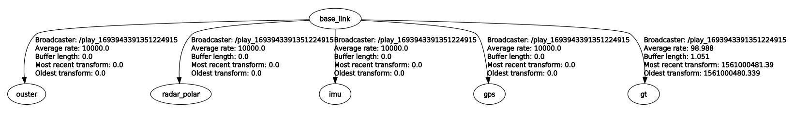

# mulran2bag

Pure command line tool that converts MulRan datasets to bag files.
This implementation is based on [file_player_mulran](https://github.com/irapkaist/file_player_mulran).


Requirements: 

1. Download MulRan datasets: https://sites.google.com/view/mulran-pr/dataset
2. Order the downloaded data: https://www.youtube.com/watch?v=uU-FC-GmHXA

After completing these steps, the root folder should contain a `global_pose.csv` and a `sensor_data` folder.
The path to the root folder can be passed to the `mulran2bag`-Node:

```console
rosrun mulran2bag mulran2bag path/to/ROOT
```
to convert it to a bag-file named `out.bag`.

## Data

| Sensor                 | Topic           | Message                     |
|------------------------|-----------------|-----------------------------|
| Ouster OS1-64 LiDAR    | `os1_points`    | `sensor_msgs/PointCloud2`   |
| Navtech Radar CIR204-H | `Navtech/Polar` | `sensor_msgs/Image`         |
| Xsens IMU              | `ìmu/data_raw`  | `sensor_msgs/Imu`           |
|                        | `imu/mag`       | `sensor_msgs/MagneticField` |
| GPS                    | `gps/fix`       | `sensor_msgs/NavSatFix`     |
## Transformations



### Dynamic Transformations

The ground truth is used to generate a dynamic transformation from `base_link` to `gt`.
Since the `gt` frame is added below `base_link` you can start another localization without destroying the tf tree.

### Static Transformations

All static transformations are generated exactly as a static transform broadcaster would do it and are written to the `tf_static`-topic.

Currently implemented **static** transformations:
- `base_link` to `ouster`
- `base_link` to `radar_polar`

Currently missing static transformations:
- `base_link` to `gps` (set to identity)
- `base_link` to `imu` (set to identity)

Feel free to contact me if you know them.
I set these missing transformations to identity.

## Customization

Right now you have to change the code in `src/mulran2bag.cpp`:

```cpp
std::string gt_frame = "gt";
std::string base_frame = "base_link";

std::string ouster_topic = "os1_points";
std::string ouster_frame = "ouster";

std::string navtech_frame = "radar_polar";
std::string navtech_topic = "Navtech/Polar";

std::string xsens_frame = "imu";
std::string xsens_topic = "imu/data_raw";
std::string xsens_mag_topic = "imu/mag";

std::string gps_frame = "gps";
std::string gps_topic = "gps/fix";

std::string tf_static_topic = "tf_static";
std::string tf_topic = "tf";

// start ground truth tf at zero
// - disabling this leads to visualization issues
//   in RViz because of floating point issues
bool zero_gt_tf = true;

// enable parts of export
bool add_ouster = true;
bool add_radar = true;
bool add_imu = true;
bool add_gps = true;
bool add_dynamic_tf = true;
bool add_static_tf = true;

// hard code imu covariances
double imu_orientation_cov[3] = {3.0, 3.0, 3.0};
double imu_ang_vel_cov[3]     = {3.0, 3.0, 3.0};
double imu_lin_acc_cov[3]     = {3.0, 3.0, 3.0};
```

All default values were taken from [file_player_mulran](https://github.com/irapkaist/file_player_mulran).

## Issues

### GPS

I do not know what model it is, nor where it is located.
Data is published on `gps/fix` topic.

### Xsens IMU

Because the file in the raw data is called `xsens_imu.csv`, I assume that it is an Xsens IMU.
I do not know what model it is, nor where it is located.
The data is published in the `ìmu/data_raw` section.
Warning: 
As soon as magnetometer data is found, another topic will be created: `ìmu/mag`.

